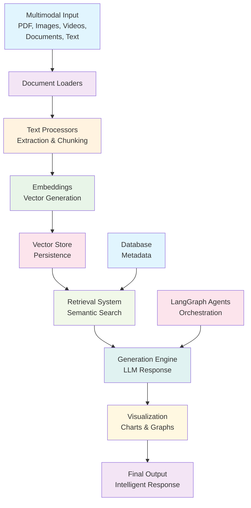

# Multimodal RAG Chat Application

A production-ready RAG (Retrieval-Augmented Generation) system that processes multiple document types and generates intelligent responses with charts and visualizations.

## Features

✅ **Multimodal Input Support**
- PDF documents
- Images (JPG, PNG, GIF)
- Videos (MP4, WebM)
- Word documents (.docx, .pptx)
- Text files

✅ **Advanced RAG Pipeline**
- Vector embeddings with persistence
- Semantic search & retrieval
- Context-aware responses
- LangGraph agent orchestration

✅ **Data Visualization**
- Automatic chart generation
- Graph creation from analysis
- Statistical summaries

✅ **Persistence Layer**
- SQLite database for metadata
- Vector DB for embeddings
- Document versioning

✅ **Functional Programming**
- Pure functions for transformations
- Immutable data structures
- Composable pipelines

## Architecture



### Project Structure

```
multimodal-rag-chat/
├── src/
│   ├── config.py          # Configuration management
│   ├── models.py          # Data models & schemas
│   ├── database/
│   │   ├── sqlite_handler.py  # SQLite operations
│   │   └── vector_store.py    # Vector DB operations
│   ├── loaders/
│   │   ├── document_loader.py # Multi-format loaders
│   │   ├── pdf_loader.py
│   │   ├── image_loader.py
│   │   ├── video_loader.py
│   │   └── text_loader.py
│   ├── processors/
│   │   ├── text_processor.py   # Text extraction & processing
│   │   ├── embeddings.py       # Embedding generation
│   │   └── chunking.py         # Smart chunking strategies
│   ├── retrieval/
│   │   ├── retriever.py        # Semantic retrieval
│   │   └── ranking.py          # Result ranking
│   ├── generation/
│   │   ├── generator.py        # LLM-based generation
│   │   └── formatter.py        # Response formatting
│   ├── visualization/
│   │   ├── charts.py           # Chart generation
│   │   ├── graphs.py           # Graph creation
│   │   └── analysis.py         # Statistical analysis
│   ├── agents/
│   │   ├── orchestrator.py     # LangGraph orchestration
│   │   └── tools.py            # Agent tools
│   └── utils/
│       ├── logging.py
│       └── helpers.py
├── main.py                     # Entry point
├── requirements.txt
├── .env.example
└── tests/
    └── test_pipeline.py
```